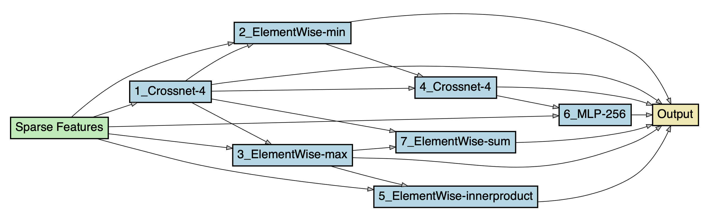
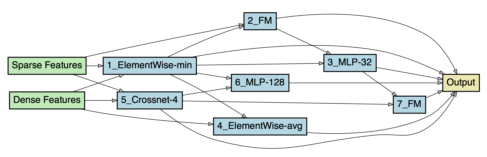

# NAS-CTR

The codes for *NAS-CTR: Efficient Neural Architecture Search  for Click-Through Rate Prediction*

# Dataset

- Use `python codes/datasets/avazu.py dataset_path` to preprocess [Avazu](https://www.kaggle.com/c/avazu-ctr-prediction/data).
- Use `python codes/datasets/criteo.py dataset_path` to preprocess [Criteo](https://www.kaggle.com/c/criteo-display-ad-challenge).

# Search

Use `python codes/main_search.py --use_gpu=True --gpu=xxx --dataset=xxx --dataset_path=xxx` to search on chosen dataset.

# Evaluate

You have to set the architecture in the `main` function of `codes/main_evaluate.py` and use `python codes/main_evaluate.py --use_gpu=True --gpu=xxx --dataset=xxx --dataset_path=xxx` to retrain and evaluate the architecture searched by NAS-CTR.

# Searched Architectures

- For Avazu:
  

- For Criteo:
  

# License
The codes and models in this repo are released under the GNU GPLv3 license.